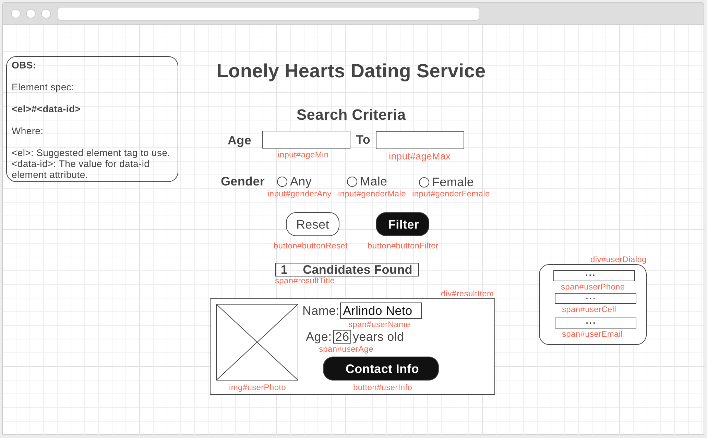

Lonely Hearts Dating Service
=========

### Local Setup
$ git clone https://github.com/ldramowicz/lonely-hearts-dating.git  
$ cd lonely-hearts-dating\
$ npm install

### Run Locally
$ npm start\
navigate to **http://localhost:3000** in browser

### Run Tests
$ npm test

### Build
$ npm run build

Objective
=========
A fictional client, Lonely Hearts, wants to create a dating service for its customers. Create a page that can query the Lonely Hearts database and display a list of potential matches.

Guidelines
=========
A web API is available to retrieve raw user information. Sample API usage can be found at [Random User API](https://randomuser.me/documentation#howto).
This raw information will need to be transformed to match the display requirements below.

A single match can be obtained via: <https://randomuser.me/api/?nat=US>

This API's data can be used to retrieve all relevant match details.

These results should be displayed, unfiltered, to the user. The user can then filter these returned results by both gender and age.

User Stories
============
* As a user, when no filter is selected, I should see 10 matches
* As a user, I expect each match to display:
    * User Photo
    * Full Name (`firstName lastName`)
    * Age
    * Contact Link
* As a user, I want to be able to filter the matches by age range, inclusive
* As a user, I want to be able to filter the matches by gender
* As a user, I want to be able to view a match's contact details in a custom dialog, which should contain:
    * Phone #
    * Cell #
    * E-mail
* As a user, I should be able to reset the matchlist to ignore the current filter and display the original 10 results
* As a user, I expect the actual number of matching records to be displayed above the matches themselves, as "{X} Matches Found"
* As a user, I expect the number of displayed matches to change in response to the filtering criteria.

### Wireframe

